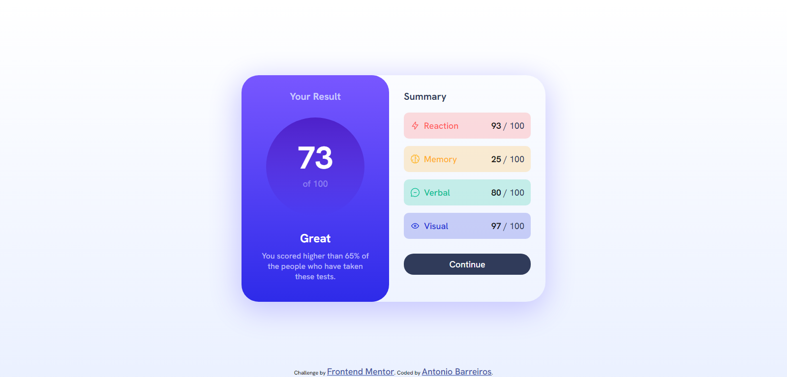
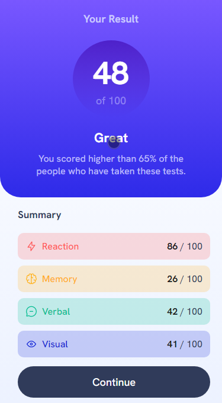

# Frontend Mentor - Results summary component solution

This is a solution to the [Results summary component challenge on Frontend Mentor](https://www.frontendmentor.io/challenges/results-summary-component-CE_K6s0maV). Frontend Mentor challenges help you improve your coding skills by building realistic projects. 

## Table of contents

- [Overview](#overview)
  - [The challenge](#the-challenge)
  - [Screenshot](#screenshot)
  - [Links](#links)
- [My process](#my-process)
  - [Built with](#built-with)
  - [What I learned](#what-i-learned)
  - [Continued development](#continued-development)
- [Author](#author)

**Note: Delete this note and update the table of contents based on what sections you keep.**

## Overview

### The challenge

Users should be able to:

- View the optimal layout for the interface depending on their device's screen size
- See hover and focus states for all interactive elements on the page

### Screenshot





### Links

- Solution URL: [Solution](https://ahmbarreiros.github.io/results-summary-component-main/)

## My process

### Built with

- Semantic HTML5 markup
- CSS custom properties
- Flexbox
- Javascript

### What I learned

Really proud for being able to work with media query and create a responsive website, also implementing javascript to create random values for the results

```html
<h1>Some HTML code I'm proud of</h1>
```
```css
@media (max-width: 620px) {
    .division {
        width: 100vw;
    }
    .result {
        width: 100vw;
        border-top-left-radius: 0px;
        border-top-right-radius: 0px;
    }
    .division > .result > .score {
        height: 130px;
        width: 130px;
        margin-bottom: 20px;
        margin-top: 25px;
    }
    .division > .result > .score > .my-score {
        padding-top: 20px;
        font-size: 54px;
    }
    .division > .result > h3 {
        margin-top: 0;
        margin-bottom: 0;
        font-size: 18px;
    }
    .division > .result > .result-text {
        width: 300px;
        height: 95px;
    }

    .division > .result > .result-text > #great {
        font-size: 22px;
        margin-bottom: 10px;
    }
    
    .division > .result > .result-text > #result-paragraph {
        margin: 5px;
    }

    .division {
        border-bottom-left-radius: 0px;
        border-bottom-right-radius: 0px;
    }
    
    .division > .summary > h3 {
        font-size: 17px;
        margin-top: -12px;
        padding-bottom: 20px;
    }
    
    .division > .summary > .points {
        width: calc(100vw - 50px);
        box-sizing: border-box;
        padding: 5px;
        margin-bottom: 10px;
    }
    
    #react, #memory, #verbal, #visual {
        padding-top: 12px;
        padding-bottom: 12px;
    }

    #react > span, #memory > span, #verbal > span, #visual > span {
        font-size: 16px;
    }
    
    #react > span > *, #memory > span > *, #verbal > span > *, #visual > span > * {
        font-size: 16px;
    }
    
    #react > p, #memory > p, #verbal > p, #visual > p {
        font-size: 16px;
    }
    
    #react > p > span, #memory > p > span, #verbal > p > span, #visual > p > span {
        font-size: 16px;
    }

    #continue-btn {
        margin-top: 5px;
        cursor: pointer;
        padding-top: 15px;
        padding-bottom: 15px;
        border-radius: 40px;
    }

    footer {
        margin-top: 30px;
        position: relative;
    }
}
```
```js
function randomScore() {
    let num = Math.floor(Math.random() * 101);
    return num;
}


function yourScore() {
    let totScore = 0;
    for(let i = 0; i < data.length; i++) {
        totScore += data[i].score;
    }
    return Math.floor(totScore / data.length)
}
```
### Continued development

In my next projects I will try to focus on mobile-first workflow and continue to work with javascript

## Author

- GitHub - [@ahmbarreiros](https://github.com/ahmbarreiros)
- Frontend Mentor - [@ahmbarreiros](https://www.frontendmentor.io/profile/ahmbarreiros)
- LinkedIn - [@Antonio](https://www.linkedin.com/in/ant%C3%B4nio-henrique-0aa9a2242/)